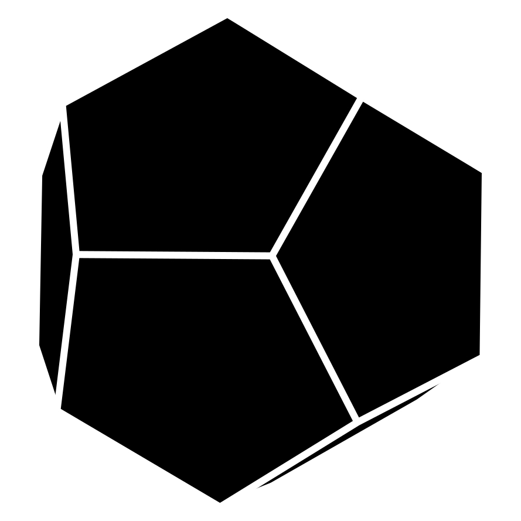
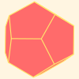

# Dodecahedron Creator

| Theme | SVG | GIF |
|-------|-----|-----|
| Default |  |  |
| Blueprint |  |  |
| Sunset |  |  |

## What is this?

I needed to produce a dodecohedron, with black surfaces and gaps betweens them, that I could also animate. The included script opens a model, allows you to position it in a GUI, and then outputs an SVG.

## Resources

The model is from [Polyhedra Viewer](https://polyhedra.tessera.li/dodecahedron/info)
